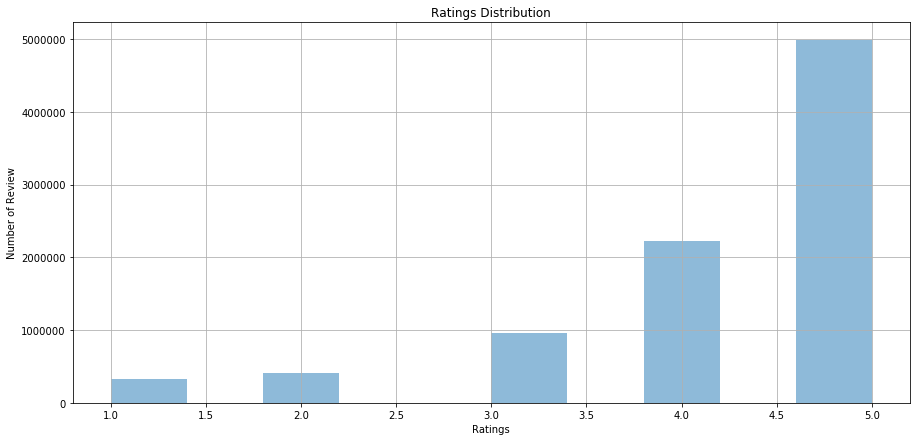
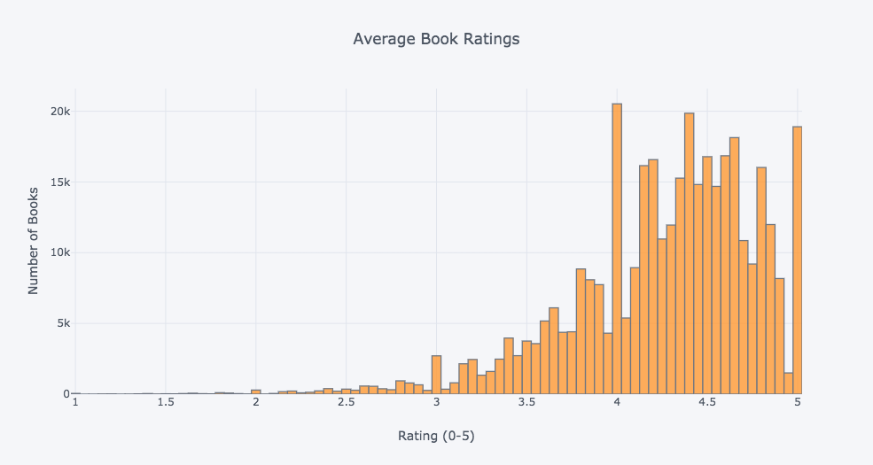
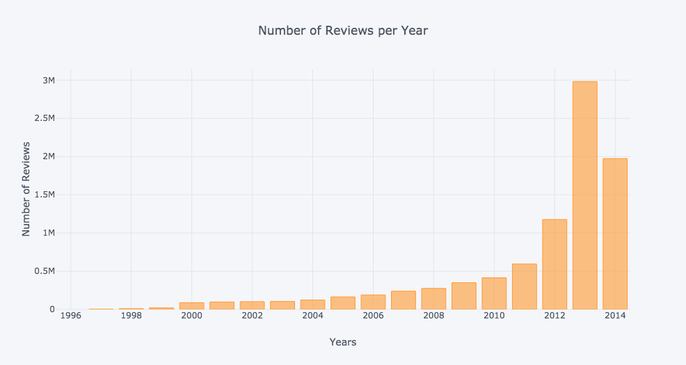
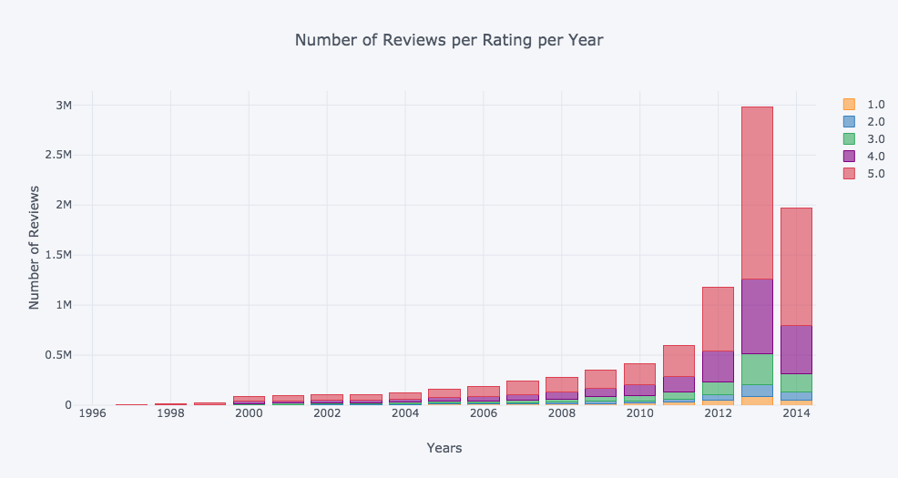
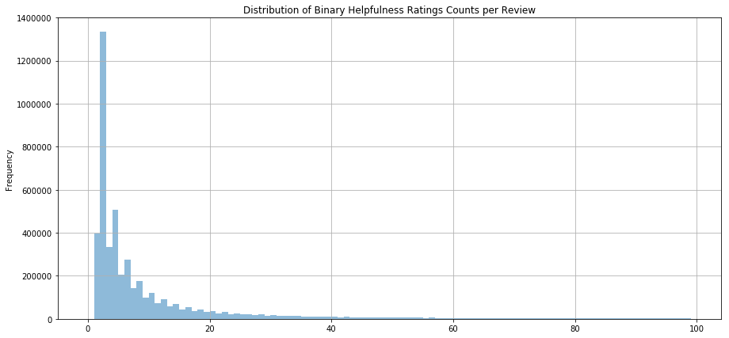
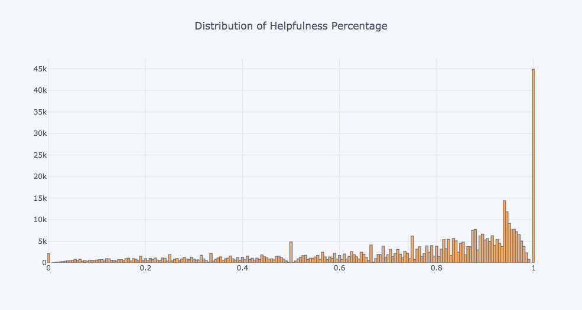

# Data Exploration Report: 000

## Note
Rendering images may prove to be challenging, so start a Notebook with:
```
jupyter notebook --NotebookApp.iopub_data_rate_limit=1.0e10
```

## Data Inspection
The inspection begins with a distribution of the review ratings, which appears in the below figure. As it is evident, close to half of the book reviews are rated with 5 stars, a quarter of them with 4 and the remaining quarter is distributed amongst the 3, 2 and 1 ratings. In order to get a clearer idea of how books are rated in overall, rather than look at the distribution of ratings amongst all reviews, the distribution of average book ratings was also generated and appears below. The chart was generated to show 100 bins. The highly skewed to the right distribution confirms that the majority of books have reviews between 4 and 5 stars. As such, one should expect that this will be reflected in the text that accompanies the respective reviews, which means that negative reviews will be more difficult to find.

### Column Fields of Interest
In general, the loaded dataframe, include 7 fields:
* `reviewerID: A `String` (probably a hashText) that uniquely identifies the user that submitted the review.     
* `asin`: ASIN stands for **Amazon Standard Identification Number**. Almost every product on **Amazon** has its own **ASIN**, a unique code used to identify it. For books, the **ASIN** is the same as the book's **ISBN** number.       
* `reviewerName`: The name of the reviewer.       
* `helpful`: Amazon has implemented an interface that allows customers to vote on whether a particular review
has been helpful or unhelpful. This is captured by this field, which represents a rating of the review, e.g. if `[2,3] --> 2/3`. 
* `reviewText`: The actual review provided by the reviewer.         
* `overall`: The product's rating attributed by the same reviewer.            
* `summary`: A summary of the review.        
* `unixReviewTime`:  Time of the review (unix time).
* `reviewTime`: Time of the review (raw).

Of these fields, for the purposes of this project we care to keep the `reviewerID`, `asin`, `reviewText`, `overall` and `helpful`. Specifically, we keep `reviewerID` only to merge it with `asin` and create unique identifier (`key`) per review, e.g.:

```python
key = reviewerID:"A10000012B7CGYKOMPQ4L" + asin:"000100039X"
```

`asin` is obviously necessary to identify the distinct books in the dataset, while the rest are necessary for the analysis (`overall`, `reviewText`) and for evaluation (`helpful`) purposes.


### Distribution of ratings amongst all reviews


### Distribution of Average Book Ratings


### Reviews per Year


### Reviews per Year (stacked by Rating)


### Distribution of Binary helpfulness Ratings Counts per Review


### Distribution of Binary Helpfulness Ratings Counts per Review


### Distribution of Helpfulness Percentage



